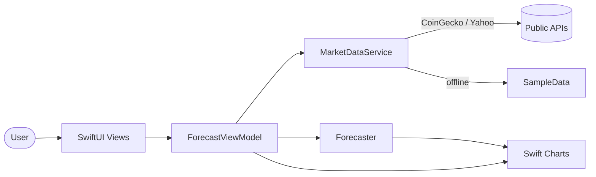
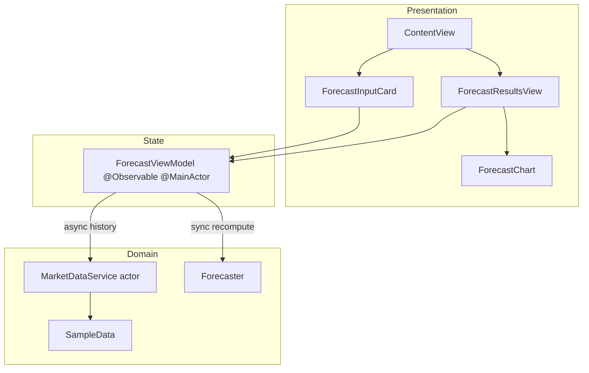
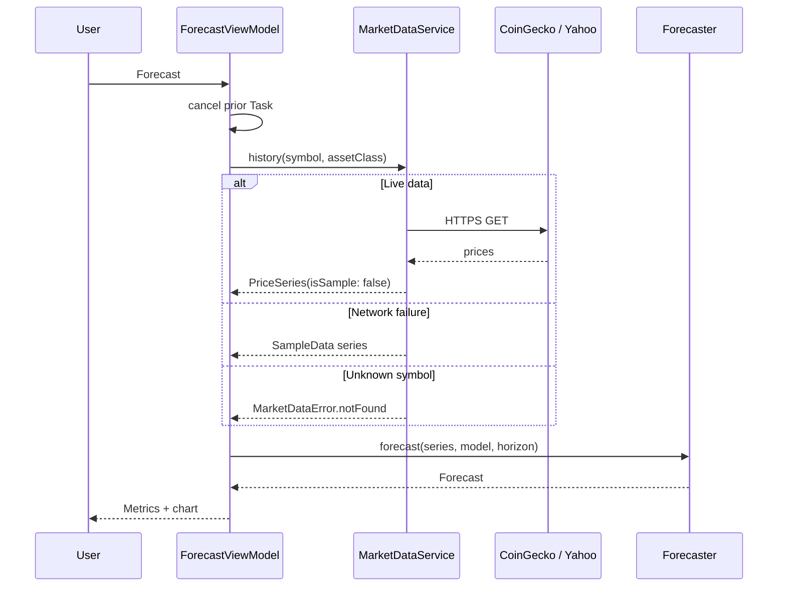
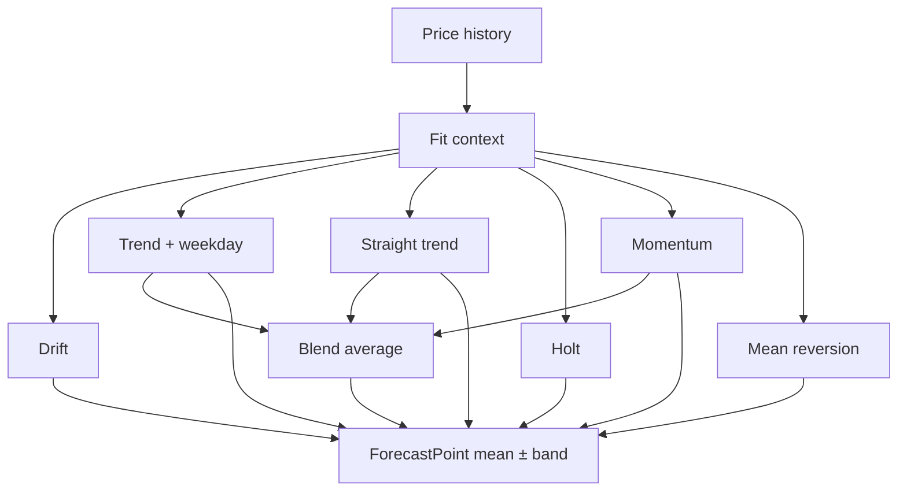

# Hummingbird Architecture

An Apple-caliber walkthrough of how Hummingbird fetches prices, forecasts on-device, and presents results — with no backend, no accounts, and no API keys. Pro subscriptions never buy better data; Free and Pro share the same key-less public feeds.

## Product principle

> **Privacy by architecture.** The phone is the computer. Market history arrives over HTTPS; every prediction is computed locally and discarded when the session ends.



## Layers

| Layer | Responsibility | Key types |
| --- | --- | --- |
| **App** | Scene, tint, system chrome | `HummingbirdApp` |
| **Views** | Presentation, accessibility, sheets | `ContentView`, `ForecastInputCard`, `ForecastChart` |
| **ViewModels** | Inputs, loading, cancellation | `ForecastViewModel` (`@Observable`) |
| **Services** | Networking + math | `MarketDataService`, `Forecaster` |
| **Models** | Immutable value types | `PriceSeries`, `Forecast`, `ForecastModel` |



## Forecast pipeline

1. User chooses asset class, symbol, horizon, and model.
2. `ForecastViewModel.run()` cancels any in-flight task, then awaits `MarketDataProviding.history`.
3. On network failure (except “not found”), `SampleData` supplies a deterministic walk and the UI shows a sample banner.
4. In parallel, `EconomicDataService` loads live Yahoo daily rates (^IRX / ^TNX). Failed series are omitted — no silent samples. BLS, Stooq, and annual World Bank macros were removed (unreliable or too stale for ≤90d sketches).
5. Selected indicators become a `MacroAdjustment` via `MacroAdjuster` (cadence-weighted scenario nudge + wider bands).
6. `Forecaster.forecast` fits classic **Drift** / **Holt**, trend / seasonality / momentum (**Peregrine**) / reversion — or **Phoenix**, an equal-weight blend of Skylark, Meadowlark, and Peregrine.
7. Results bind into metrics and a Swift Charts view with an **uncalibrated residual band** (possible range — not a verified confidence interval). Sample price/macro banners appear whenever fallbacks are used.



## Model catalogue

| Method | Strategy | Status |
| --- | --- | --- |
| **Drift** | Random walk with drift | Ready (free classic) |
| **Trend + weekday** | Linear trend + weekday seasonality | Ready (default) |
| **Straight trend** | Pure least-squares trend | Ready |
| **Holt** | Holt linear exponential smoothing | Ready (free classic) |
| **Momentum** | EMA-gap momentum | Ready (Pro) |
| **Mean reversion** | Mean reversion to SMA | Beta (Pro) |
| **Blend** | Average of Trend + weekday, Straight trend, Momentum | Beta (Pro) |



## Concurrency & privacy

- `MarketDataService` is an **actor** — network and parsing stay off the main actor.
- `ForecastViewModel` is `@MainActor` + `@Observable` — UI state is always main-thread.
- In-flight runs are cancelled when the user taps Forecast again.
- `PrivacyInfo.xcprivacy` declares: no tracking, no collected data types, no required-reason API use.
- Economic indicators are **educational what-ifs** from free public feeds — never paid vendors, never FRED keys.

## Testing

`HummingbirdTests` covers:

- Horizon length and finite ensemble output
- Insufficient-history empty forecasts
- Deterministic sample data / stable seeds
- Known-line least-squares fit

```bash
xcodegen generate
xcodebuild test -scheme Hummingbird -configuration Debug \
  -destination 'platform=iOS Simulator,name=iPhone 17 Pro'
```
